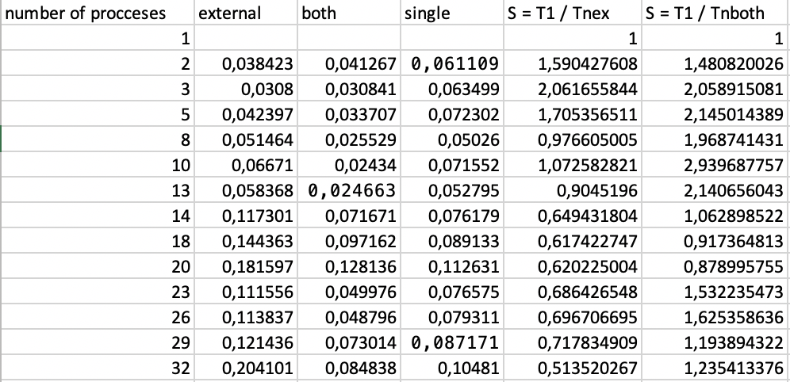
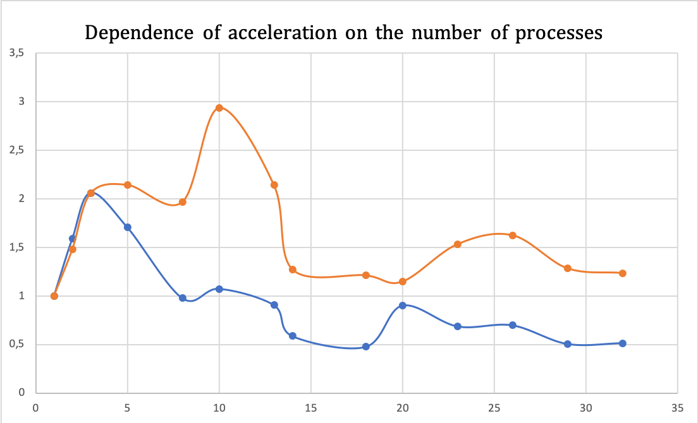

# Efficiency and acceleration of parallel programs
Laboratory work
## Launch
```bash
./build.sh
./run.sh [number of processes]
```
## Content
```lab.pdf``` - task

```lab.c``` - main task

```lab_second.c``` - optional task
## First Task 
Make parallel version of this function:
```
void cycle(double ** a) {
    int i, j;
    for (i = 0; i < ISIZE; i++) {
        for (j = 0; j < JSIZE; j++) {
            a[i][j] = 10 * i + j;
        }
    }
    for (i = 0; i < ISIZE; i++) {
        for (j = 0; j < JSIZE; j++) {
            a[i][j] = sin(0.00001 * a[i][j]);
        }
    }
}
```
### Functions
```void func(int rank, int size, double* res)``` - function that runs on every process. 
We make parallelization of external cycle, devide rows of matrix and gave them for slave processes
as a task. Master process collect the result of computations. 

```void cycle(double* res, int start, int limit)``` - computation function

```void func_second(int rank, int size, double* res_second)``` - function that runs on every process. 
We make parallelization of external and internal cycles, devide rows * columns of matrix and gave them for slave processes
as a task. Master process collect the result of computations. 

```void cycle_second(double* res, int start, int limit)``` - computation function
### Results




## Second task
Make parallel version of this function:
```
int main(int argc, char **argv) {
    double a[ISIZE][JSIZE], b[ISIZE][JSIZE];
    int i, j; FILE *ff;
    for (i = 0; i < ISIZE; i++) {
        for (j = 0; j < JSIZE; j++) {
            a[i][j] = 10 * i + j;
            b[i][j] = 0.;
        }
    }
    for (i = 0; i < ISIZE; i++){
        for (j = 0; j < JSIZE; j++){
            a[i][j] = sin(0.00001 * a[i][j]);
        }
    }
    for (i = 0; i < ISIZE - 3; i++){
        for (j = 5; j < JSIZE; j++) {
            b[i][j] = a[i + 3][j - 5] * 3;
        }
    }
    ff = fopen("result.txt", "w");
    for(i = 0; i < ISIZE; i++){
        for (j = 0; j < JSIZE; j++){
            fprintf(ff,"%f ", a[i][j]);
        }
        fprintf(ff, "\n");
    }
    fclose(ff);
}
```
### Theory material
We have loop-carried dependency. Distance vector and direction vector:

#### D = (3; 5) -> d = (<, <)

We can parallelize outer cycle but only for 8 or less processes.

